# 📈 Food Delivery Time Estimator

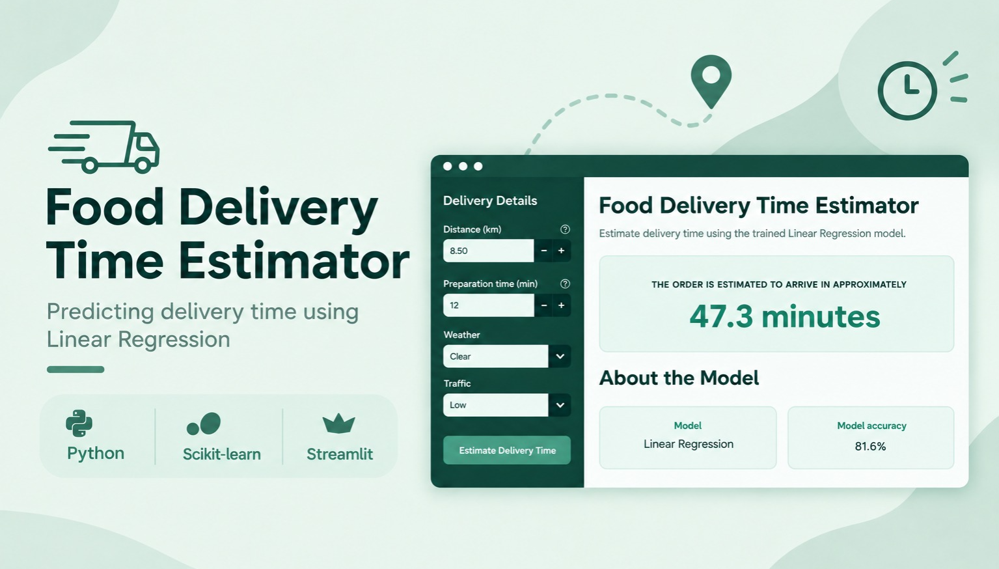

> **Project Status: Completed**

---

## 📊 Project Overview

This project predicts food delivery time in minutes using Linear Regression. The model explains 81.6% of the variation in delivery time, with an average prediction error of about 6.25 minutes.

- It includes:

    - Jupyter Notebook for data analysis and model building
    - Streamlit app for delivery-time predictions

- Model Inputs
    - Distance
    - Preparation time
    - Weather
    - Traffic level


---

## 📊 View Project

### 🔹 **Food Delivery Time Estimator App**

- Enter the delivery details, click Estimate Delivery Time button, and view the estimated delivery time.

- **Link:** [food-delivery-time-estimator-streamlit-app](https://food-delivery-time-estimator.streamlit.app/)

- **Food Delivery Time Preview**

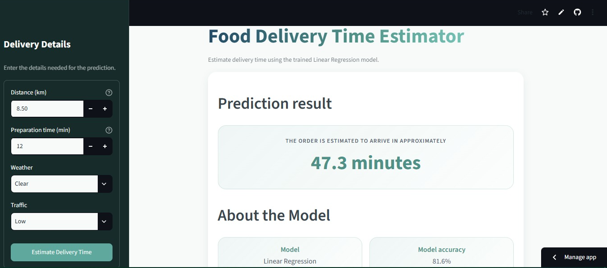


### 🔹 **Jupyter Notebook**

- Follow the complete process from loading and cleaning the data to training and evaluating the model.

- **Link:** [food-delivery-time-estimator-jupyter-notebook](https://github.com/Chauhanekta21/Food_Delivery_Time_Estimator/blob/master/jupyter_notebook/food_delivery_time_prediction.ipynb)

- **Food Delivery Time Preview**

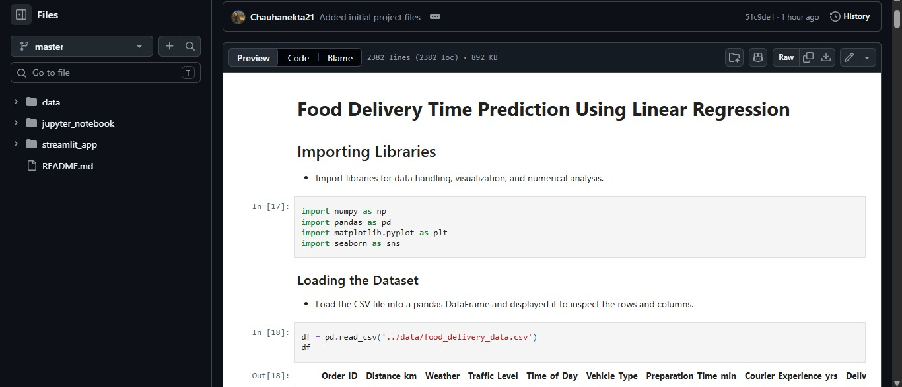

---

## 📊 Project Workflow

```
Raw Dataset
     ↓
Import the Data
     ↓
Data Inspection
     ↓
Data Cleaning & Transformation
     ↓
Explore Relationships and Correlations
     ↓
Test Categorical Relationships with ANOVA
     ↓
Select Model Features
     ↓
Convert Categories to Numeric Values - One Hot Encoding
     ↓
Separate Features (X) and Target (y)
     ↓
Split Data into Training and Testing Sets
     ↓
Train Linear Regression Model
     ↓
Evaluate Predictions
     ↓
Save the Model as a .pkl File
     ↓
Use the Model in the Streamlit App
```

---

## 📊 Dataset Information

- The dataset contains:

    - 1,000 records
    - 9 columns
    - Target column: Delivery_Time_min
    - Order details: Order_ID, Distance_km, Preparation_Time_min
    - Delivery conditions: Weather, Traffic_Level, Time_of_Day,    Vehicle_Type
    - Courier information: Courier_Experience_yrs

- **Link:** [food-delivery-dataset](https://github.com/Chauhanekta21/Food_Delivery_Time_Estimator/blob/master/data/food_delivery_data.csv)

- **Dataset Preview:**

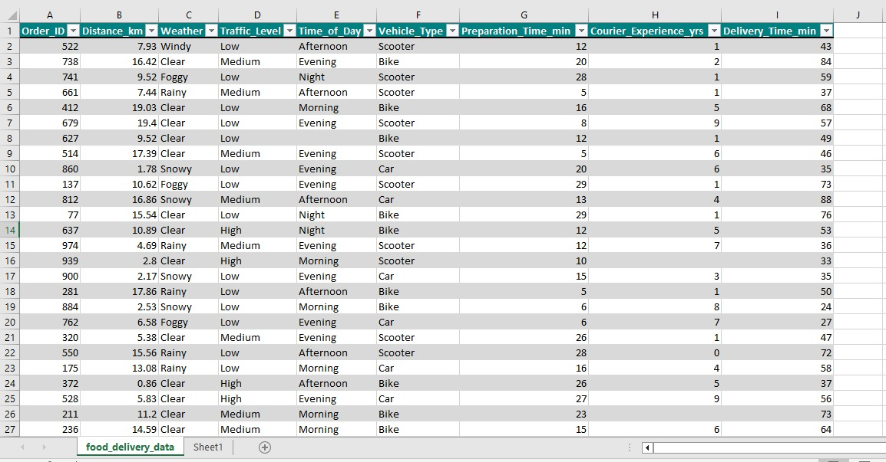

---

## 📊 Key Steps 


### 🔹 Data Import

- Loaded the food delivery dataset into a Pandas DataFrame from the data folder.

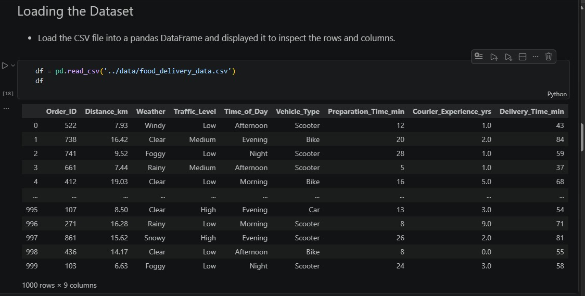

---

### 🔹 Data Inspection

- Used `info()` to review data types and column details.
- Used `describe()` to review summary statistics for numeric columns.
- Checked for missing values with `isnull().sum()`.
- Checked for duplicate rows.

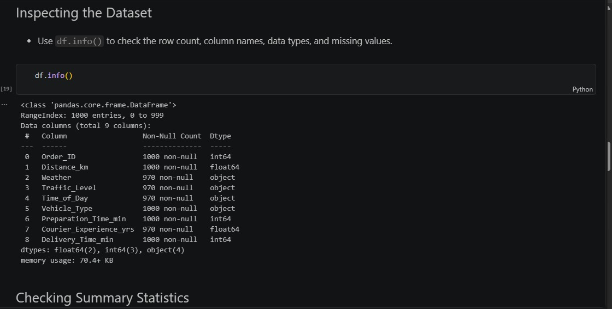

---

### 🔹 Data Cleaning & Transformation

- Created a copy of the original data before making changes.
- Filled missing values in `Weather`, `Traffic_Level`, and `Time_of_Day` with the most common value, called the mode.
- Filled missing `Courier_Experience_yrs` values with the median.
- Verified the cleaned dataset after filling the missing values.

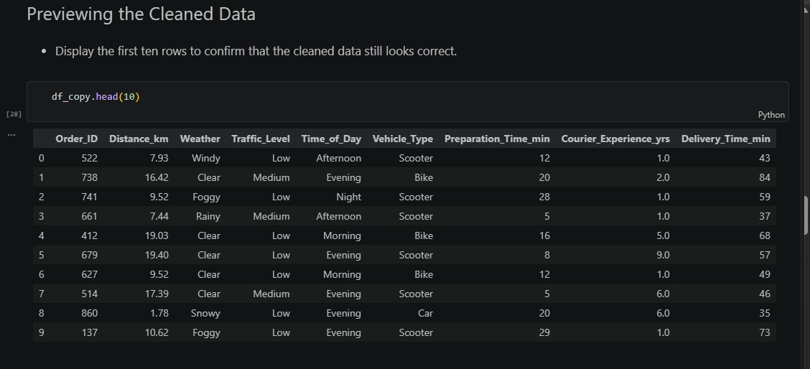

---

### 🔹 Exploratory Data Analysis

- Used pair plots to compare numeric variables.

- Calculated correlations with Delivery_Time_min and visualized them using a correlation heatmap.

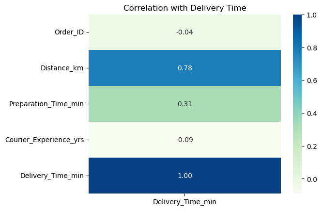

<hr>

- Used an ANOVA test to compare average delivery times across weather, traffic, time of day, and vehicle type categories.

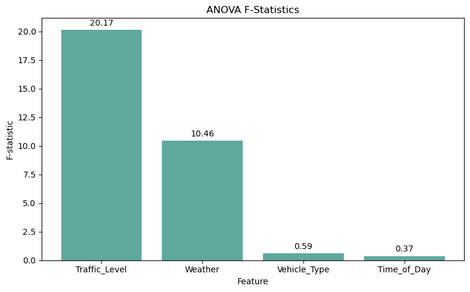

---

### 🔹 Feature Selection

- Trained the model using Distance_km, Preparation_Time_min, Weather, and Traffic_Level, based on correlation and ANOVA analysis; excluded Order_ID, Vehicle_Type, Time_of_Day, and Courier_Experience_yrs.

---

### 🔹 One-Hot Encoding

- Converted Weather and Traffic_Level into numeric indicator columns, making the data suitable for Linear Regression.


---

### 🔹 Split X and y Features

- The dataset was split into 80% training data and 20% testing data to train and evaluate the model.

    - **X:** The input features used to make a prediction.
    - **y:** The target column, `Delivery_Time_min`.

---

### 🔹 Model Training

- Created a `LinearRegression` model using scikit-learn.
- Trained the model with the training data.

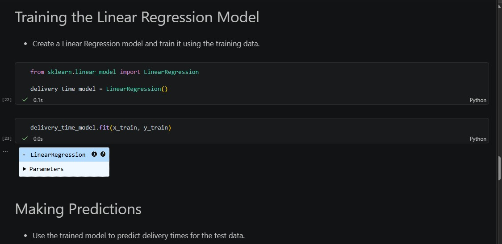


---

### 🔹 Model Evaluation

- The model was evaluated on the test data using these metrics:

    - R² Score: 81.6% — explains 81.6% of the variation in delivery time.
    - Adjusted R²: 81.4% — R² adjusted for the number of features.
    - MSE: 82.51 — average squared prediction error.
    - MAE: 6.25 minutes — average prediction error.
    - RMSE: 9.08 minutes — gives more weight to larger errors.

- The training R² is 75.2% and test R² is 81.6%, so there is no major overfitting gap.

- Plotted actual vs predicted delivery times to assess model performance; most predictions are close to actual values, indicating a good    model fit with a few larger errors.

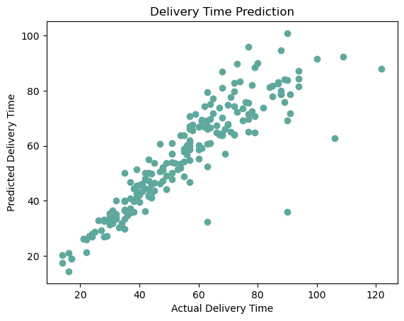

<hr>

- Residual plots show that most errors are close to zero, with a few larger positive errors.

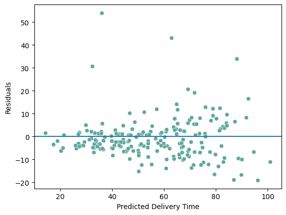

---

### 🔹 Save the Trained Model

- Saved the trained Linear Regression model as `delivery_time_model`.pkl.
- The saved model is reused in the Streamlit app without retraining.

---

## 📊 Tools and Libraries

- Python
- Jupyter Notebook
- Pandas
- NumPy
- Matplotlib
- Seaborn
- SciPy
- Scikit-learn
- Joblib
- Streamlit

---

## 📊 Repository Structure

```
Food_Delivery_Time_Estimator/
|-- data/
|   `-- food_delivery_data.csv
|-- images/
|   `-- 13 project images
|-- jupyter_notebook/
|   `-- food_delivery_time_prediction.ipynb
|-- streamlit_app/
|   |-- app.py
|   |-- delivery_time_model.pkl
|   `-- requirements.txt
`-- README.md
```

---

## 📊 Skills Demonstrated

- Data cleaning and preprocessing
- Exploratory data analysis (EDA)
- Data visualization with Matplotlib and Seaborn
- Statistical analysis using correlation and ANOVA
- Feature selection and engineering
- Categorical data encoding
- Regression modeling with Linear Regression
- Model performance evaluation
- Model deployment with Streamlit
- Model serialization and reuse with Pickle

---

## 📊 Author

**Ekta Singh Chauhan**

Data Analyst

Focused on building projects in:

- Excel
- SQL
- Python
- Power BI
- Data Analytics
- Machine Learning

---

## 📊 Disclaimer

This project is for educational and portfolio purposes only. The estimated delivery time is based on the patterns in this dataset and should not be treated as a guaranteed delivery time for real orders.
